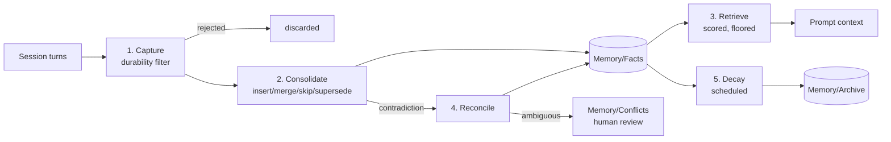

# Build Plan — Memory Engineering for the Obsidian Vault

Implementing the five-stage memory pipeline (Capture → Consolidate → Retrieve → Reconcile → Decay)
on top of this repo's existing Obsidian + Claude Code skills.

**Status:** Phases 0–5 implemented (Phase 6, embeddings, remains conditional/deferred — see §5). 45 automated tests passing.
**Source:** [@0xWast3, "Memory Engineering: The Discipline That Decides Whether Your AI Agent Has a Past"](https://x.com/0xWast3/status/2084625810112032849) (4 Aug 2026).

### What actually landed vs. this plan

The implementation matches this plan's architecture and corrections closely, with a few
additions made along the way:

- **`merge` subcommand** (not in the original plan): `supersede` always mints a new record,
  which turned out to be the wrong primitive for collapsing two *existing* near-duplicates
  found during `/memory-gc` — it would have created a third record instead of removing the
  duplicate. `merge --keep-id --drop-id` marks the duplicate superseded by the record you're
  keeping, with no new record, and counts as a reinforcement of the survivor.
- **Decay staleness tracking** (`last_decay_at` / `created_at` in `index.json`, surfaced by
  `health` as `decay_overdue`): since this environment has no daemon or cron, §5's "scheduled
  job" is realized as `/memory-health` checking whether decay is overdue and running it,
  rather than an actual background schedule. This works only because `compute_confidence` is
  a pure function of elapsed time (§4.5) — running decay "whenever someone happens to run
  `/memory-health`" gives identical results to a strict schedule.
- **§9 open questions, resolved:** `CLAUDE.md`'s pinned block is `<!-- pinned:start/end -->`,
  owned exclusively by `/preserve`; the generated block is `<!-- generated:start/end -->`,
  owned exclusively by `render-claude-md`, which replaces only that span and passes every
  other byte of the file through untouched (tested — see
  `RenderClaudeMd.test_preserves_content_outside_generated_block`). Migration is
  non-destructive: `migrate-claude-md` extracts bullets into `Memory/Facts/` and never
  modifies the source `CLAUDE.md`; `/memory-gc` is the intended cleanup pass once the
  extraction is trusted. The reinforcement signal (open question 1) is unresolved in this
  implementation — `reinforce` exists as a primitive and `/compress`'s capture pass calls it
  on restatement, but there's no attempt at detecting "Claude cited this and the user acted
  on it," per the plan's own note that this needs real usage data first.
- Phase 6 (embeddings) was not built. Retrieval relevance is lexical (token Jaccard
  overlap) per the Phase 3 baseline; per the plan, embeddings are conditional on measured
  precision@5 falling short, which requires real usage this repo doesn't have yet.
- **Bug found during implementation, not anticipated by the plan:** raw Jaccard overlap on
  unfiltered tokens let stopwords ("a", "is", "the"...) alone push completely unrelated
  short facts above the retrieval floor — e.g. "tell me a joke about spaceships" matched
  "Favourite coffee order is a flat white" on the shared word "a". Fixed by stripping a
  stopword list in `tokenize()`; regression-tested in
  `test_stopword_overlap_alone_does_not_clear_the_floor`. Worth flagging because it's the
  kind of failure that a scenario-level walkthrough (§6) would likely have caught anyway,
  but the mechanically-checkable `retrieval-queries.yaml` fixture (`tests/scenarios/`)
  caught it immediately when actually run against the CLI.

---

## 1. Why this repo is the right host

The article's thesis is that replaying history is not memory. This repo currently implements
replay, precisely:

| Stage | Article's failure mode | What this repo does today |
|---|---|---|
| Capture | "captures indiscriminately" | `/compress` is a **logger** — it saves every checked category with no durability filter |
| Consolidate | "just grows" | `/preserve` appends to `CLAUDE.md`. Ten mentions of one preference become ten lines |
| Retrieve | "chronological, not relevant" | `/resume` reads **the last 3 logs** regardless of what today's work is about |
| Reconcile | "accumulates contradictions" | Nothing. Old and new facts sit side by side in `CLAUDE.md` |
| Decay | "unsearchable landfill" | Only a crude proxy: archive when `CLAUDE.md` > 280 lines. Length, not relevance |

So this isn't a greenfield build — it's a retrofit that turns an honest implementation of the
anti-pattern into an implementation of the pipeline. The vault is already the persistence layer,
`obsidian-mcp` is already the I/O layer, and the six slash commands are already the interface.
What's missing is the memory architecture between them.

---

## 2. Core architectural decisions

### 2.1 Markdown is the store of record; no database

Every memory is one markdown file with YAML frontmatter under `Memory/Facts/`. Not SQLite, not a
vector DB.

Rationale: the product's entire value proposition is that your AI brain is *your vault* — greppable,
linkable, visible in the Obsidian graph, hand-editable, git-diffable. A binary store would make
memory opaque to the user, which is the failure mode this whole discipline exists to fix. A derived
`Memory/index.json` carries computed scores and stats; it is rebuildable from the markdown at any
time, so hand-edits in Obsidian can never desync the source of truth.

### 2.2 Split the semantic store from the episodic log

The article treats "memory" as one store. We split it:

- **Episodic** — `Areas/Work/Session-Logs/` (exists today). Raw, append-only, never deduped, never
  decayed. The audit trail and provenance source.
- **Semantic** — `Memory/Facts/` (new). Distilled, deduplicated, reconciled, decaying. This is what
  gets retrieved into context.

Retrieval reads the semantic store. Session logs are only opened when a memory's provenance is
questioned or the user explicitly searches history. This is what stops `/resume` from paying
transcript-replay costs.

### 2.3 Claude judges; Python computes

A hard split, and the biggest deviation from the reference code:

- **Claude (slash commands)** does everything requiring judgment — is this durable? do these two
  statements contradict? how should these merge?
- **Python (`scripts/memory.py`)** does everything deterministic — decay math, score ranking,
  lexical candidate shortlisting, index maintenance, archival transitions.

The article's classifiers are keyword lists (`"i prefer" in statement`, negation pairs like
`("is", "was")`). Those are the weakest part of the reference implementation: they're brittle,
English-only, and miss the majority of real phrasings ("skip the preamble on reviews from now on"
matches nothing). We already have a language model in the loop — using substring matching for
semantic classification while a frontier model sits idle is the wrong tool assignment. Conversely,
decay arithmetic must be exact and testable, which is the wrong job for an LLM.

### 2.4 Capture runs at session boundaries, not per turn

The article's `MemoryEngine.process_turn()` classifies every statement as it's said. For a Claude
Code setup that means an extra inference on every user turn — real latency and token cost on the hot
path.

We run capture in a batch pass inside `/compress` (session end) plus an explicit `/remember` escape
hatch for mid-session facts the user wants pinned immediately. Batching also *improves* capture
quality: classifying a fact with the whole session visible beats classifying it in isolation at
turn 12.

Trade-off accepted: a session that ends without `/compress` (crash, closed terminal) loses its
captures. Mitigation in Phase 1 — `/compress` can be run against the session log after the fact, and
Phase 5's health check flags session logs that were never capture-processed.

### 2.5 Confidence is derived, not stored

See §4.5. This is the single most important correction to the reference design.

---

## 3. Data model

```
VAULT_PATH/
├── CLAUDE.md                    # generated view + hand-pinned block (never auto-edited)
├── Memory/
│   ├── Facts/                   # active memories, one file each
│   │   └── mem-20260810-a3f2.md
│   ├── Archive/                 # decayed below threshold — recoverable, never deleted
│   ├── Conflicts/               # flag_conflict queue awaiting human review
│   └── index.json               # derived: scores, access stats, optional embeddings
└── Areas/Work/Session-Logs/     # unchanged
```

A memory record:

```markdown
---
id: mem-20260810-a3f2
type: memory
class: durable              # durable | expiring
content: Prefers terse code reviews with no preamble
subject: code-review-style  # consolidation key — facts sharing a subject are merge candidates
scope: work                 # null | work | personal — enables "coexist" without conflict
base_confidence: 0.80       # confidence at last reinforcement; decay is computed from this
captured_at: 2026-08-10T13:01:00Z
last_reinforced: 2026-08-10T13:01:00Z
reinforce_count: 1
last_retrieved: 2026-08-10T13:01:00Z   # deliberately NOT the same as last_reinforced
expires_at: null            # required when class == expiring
status: active              # active | archived | superseded
supersedes: null
superseded_by: null
source: Session-Logs/2026-08-10-13-01-memory-plan.md
---

Prefers terse code reviews with no preamble.

## Provenance
> "just give me the diff notes, skip the summary paragraph"
— session 2026-08-10, turn 42
```

`status` and the `supersedes`/`superseded_by` pair mean **nothing is ever hard-deleted**. Superseded
facts stay on disk, excluded from retrieval, available for audit. A memory system you can't audit is
one you have to double-check, which defeats the point.

---

## 4. The five stages as built here



### 4.1 Capture — `/remember`, and a pass inside `/compress`

A **rejection system first**. The test, applied by Claude rather than a keyword list: *would this
still be true and useful in three months?*

Three classes, but note that only two are ever written: `ephemeral` exists as an explicit reject
label for logging and precision measurement, not as a stored state.

Deviation from the reference: the article's `classify_for_capture` returns `None` for anything
without preference/stable-fact keywords, so it silently drops the majority of durable facts phrased
in any other way. We invert the default — Claude proposes candidates from the full session, then
each candidate must justify durability against the three-month test, with the rejected list shown to
the user in the `/compress` summary so over- and under-capture are both visible.

Output per accepted fact: `content`, `class`, `subject`, `scope`, `confidence`, provenance quote.

### 4.2 Consolidate — on write

Before any insert, shortlist existing memories sharing a `subject` (cheap, deterministic, in
Python), then have Claude decide: `insert` | `merge` | `skip` | `supersede`.

Deviation: the reference uses `SequenceMatcher` on raw strings — pure lexical overlap. "I use pnpm"
and "moved off npm last month" have near-zero character similarity and would both be stored as
unrelated facts. Subject-keying plus semantic judgment catches these. The `subject` field is what
makes this cheap: it turns an O(n) semantic comparison across the whole store into an O(k) comparison
within one subject bucket.

`/memory-gc` runs the same logic retroactively across the whole store, for cleaning up the backlog
Phase 1 will generate before Phase 2 lands.

### 4.3 Retrieve — rewrite of `/resume`

Score every active memory, return those above a floor:

```
score = 0.55 * relevance      # lexical overlap w/ query; embeddings in Phase 6
      + 0.20 * confidence     # derived, see 4.5
      + 0.15 * freshness      # 1 / (1 + days_since_reinforced / 60)
      + 0.10 * reinforcement  # log1p(reinforce_count) / log1p(10), capped at 1.0
```

Two fixes to the reference `retrieve_relevant`:

1. **A score floor (~0.35), not a bare `top_k`.** The article warns that returning twenty
   marginally-related memories buries the two that matter — then implements `scored[:top_k]`, which
   returns exactly `top_k` every time regardless of quality. On a query unrelated to anything stored,
   that's five pieces of pure noise injected into context. Return `min(top_k, above_floor)`, and
   return nothing when nothing qualifies.
2. **Retrieval is not reinforcement.** The reference sets `memory.last_reinforced = now` on every
   retrieval. Since decay is driven by `last_reinforced`, *any memory retrieved once has its decay
   clock reset* — so a memory that keeps surfacing and keeps being irrelevant never decays. That
   silently disables Stage 5 for exactly the memories cluttering retrieval. We bump `last_retrieved`
   on retrieval, and `last_reinforced` only on genuine reinforcement: the fact was restated,
   explicitly confirmed, or cited by Claude in a response the user accepted.

`/resume` keeps its current briefing format so the UX doesn't regress; only the selection mechanism
changes — from "last 3 logs" to "top-scored memories for the stated task", with the session-log read
kept as an optional deep-dive.

### 4.4 Reconcile — `/memory-conflicts`

When consolidation flags a contradiction: newer fact supersedes when recency and confidence agree;
facts with different `scope` coexist; anything ambiguous goes to `Memory/Conflicts/` and is surfaced
at the next `/resume` rather than guessed.

Deviation: the reference gates supersession on `time_gap_days > 1`, so two contradicting facts
captured in the same session can never resolve — they fall through to `coexist` or `flag_conflict`
forever. Since our capture is batched per session, that gate would misfire constantly. Removed;
recency ordering is by timestamp with no minimum gap.

The `flag_conflict` path is the one to protect during implementation. It is always tempting to
auto-resolve to keep the queue empty — a system that silently picks a side when genuinely unsure
will eventually act confidently on a wrong fact.

### 4.5 Decay — `scripts/memory.py decay`, scheduled

**Confidence is computed on read, never mutated in place:**

```
half_life_effective = base_half_life * (1 + log1p(reinforce_count))
confidence(now)     = base_confidence * 0.5 ** (days_idle / half_life_effective)
```

with `base_half_life` per class (durable: 180d; expiring: hard cutoff at `expires_at`).
`base_confidence` is rewritten only on reinforcement.

This fixes the reference `apply_decay`, which subtracts `decay_rate * (1 - resistance) * (days_idle / 30)`
from stored confidence on every run. That result depends on **how often the job runs**, not on
elapsed time: run it daily for a month and a memory decays roughly thirty times further than running
it once monthly, for identical usage. Deriving confidence from a timestamp makes decay idempotent
and schedule-independent — running it twice in one day is a no-op, and a missed week self-corrects.
The scheduled job then performs only the state transition (`active → archived` below 0.15), not the
arithmetic.

Second fix: the reference lets `access_count` both raise retrieval score *and* resist decay linearly,
a compounding rich-get-richer loop that freezes early memories at the top permanently. `log1p`
damping plus the retrieval/reinforcement split above breaks it.

---

## 5. Build phases

Each phase is independently useful and independently shippable. A five-stage pipeline built
big-bang is untestable — and the middle stages are meaningless without data, so the ordering follows
the data dependency, not the article's narrative order.

| Phase | Deliverable | Acceptance criteria | Status |
|---|---|---|---|
| **0. Foundations** | Record schema; `Memory/` scaffolding in `install.sh`; `scripts/memory.py` skeleton (`init`, `reindex`); migration extracting records from an existing `CLAUDE.md` | `./install.sh` on a fresh vault produces valid structure; migration on a 280-line `CLAUDE.md` yields records with provenance; `reindex` rebuilds `index.json` from markdown alone | ✅ Done |
| **1. Capture** | `/remember`; capture pass in `/compress`; rejected-list in the summary | On a 10-scenario corpus: capture precision ≥ 0.8, recall ≥ 0.7 against hand-labelled durable facts | ✅ Built; precision/recall against `tests/scenarios/` requires live Claude runs, not automated here (see §6) |
| **2. Consolidate** | Dedup-on-write; `/memory-gc` | Re-running a session's captures twice adds zero new records; 10 mentions of one preference collapse to 1 | ✅ Done — `candidates`/`merge` tested; dedup judgment itself is Claude-side per `/memory-gc` |
| **3. Retrieve** | `/resume` rewrite; scoring in `memory.py` | precision@5 ≥ 0.7 on scenario queries; unrelated query returns **zero** memories, not five | ✅ Done — floor behavior tested (`test_unrelated_query_returns_nothing_not_noise`); precision@5 not measured (needs corpus + real usage) |
| **4. Reconcile** | Contradiction detection; `Conflicts/`; `/memory-conflicts` | Planted contradictions resolve correctly ≥ 0.85; zero silent resolutions of ambiguous pairs | ✅ Done — queue/resolution paths tested; "never silently resolves" enforced by construction (`flag-conflict` never auto-applies) |
| **5. Decay** | `decay` command; scheduling; `/memory-health` dashboard note | Decay is idempotent (1 run == 30 runs over the same 30 days); unreinforced memories archive on schedule; archived records remain recoverable | ✅ Done — idempotency directly tested (`test_decay_is_schedule_independent`, `test_running_decay_twice_is_idempotent`) |
| **6. Embeddings** *(conditional)* | Local embedding model replaces lexical relevance | Only build if Phase 3 precision@5 < 0.7. Must not add a network dependency | ⏸ Deferred — no measured precision@5 yet to trigger it |

Phase 6 is deliberately last and conditional. Embeddings are the most-reached-for and least
load-bearing part of a memory system — capture precision and decay correctness determine whether the
store is any good; retrieval math only determines how well you find things in a store that's already
either clean or a landfill.

---

## 6. Testing

Memory systems fail quietly, so the test strategy is a first-class deliverable, not an afterthought.

**Scenario corpus** — `tests/scenarios/*.yaml`, ~20 hand-written multi-session cases: input turns,
plus the asserted memory state afterward. Must include: a job change (supersession), a
context-dependent preference pair (coexistence), a fact that expires, a genuine ambiguity (must reach
the conflict queue), and a session of pure noise (must capture nothing).

**Four metrics**, tracked per phase:
- Capture precision — of facts captured, share genuinely durable
- Capture recall — of planted durable facts, share captured
- Retrieval precision@5
- Contradiction resolution accuracy

**The stranger test** — replay session N+1 with memory on and off and diff the responses. If they're
identical, the pipeline is doing nothing regardless of what the metrics say.

**Determinism test** — decay run 1× vs 30× across a simulated 30 days must produce identical state.

---

## 7. Risks

| Risk | Mitigation |
|---|---|
| Over-capture recreates the landfill the system exists to prevent | Start strict and loosen against measured recall; show the rejected list every `/compress` so both error directions stay visible |
| LLM-in-the-loop cost per session | Batch at session end (§2.4); shortlist candidates in Python before any Claude call |
| User hand-edits records in Obsidian; index drifts | Frontmatter is source of truth; `index.json` is derived and rebuildable via `reindex` |
| Silent corruption or wrongful deletion | Nothing is hard-deleted — `status` transitions only; recommend the vault be under git |
| Memory makes Claude *confidently wrong* | Conflict queue is never auto-resolved; retrieved memories carry provenance so claims are traceable |
| Scope creep into a general-purpose memory framework | Out of scope below is binding |

---

## 8. Out of scope

Multi-user or shared memory; cross-vault sync; a hosted service; memory for non-Claude-Code clients;
any network dependency beyond the existing local `obsidian-mcp`; replacing the existing note-taking
commands (`/daily-note`, `/meeting-note`, `/weekly-review` are untouched by this work).

---

## 9. Open questions

1. **Reinforcement signal.** "Claude cited it and the user accepted the response" is the ideal
   trigger, but Claude Code gives no clean accept signal. Phase 3 may have to settle for explicit
   user confirmation plus restatement detection. This weakens decay resistance accuracy and should be
   revisited once the corpus shows how often it misfires.
2. **`CLAUDE.md`'s future role.** Once `Memory/Facts/` exists, `CLAUDE.md` becomes a generated view.
   The hand-pinned block must stay hand-owned — proposal: `<!-- pinned -->` fences that the generator
   never writes inside.
3. **Migration destructiveness.** Should Phase 0's migration leave the original `CLAUDE.md` intact
   (safe, duplicated memory for a while) or replace it (clean, irreversible)? Leaning intact, with a
   `/memory-gc` cleanup once the user trusts the extraction.
